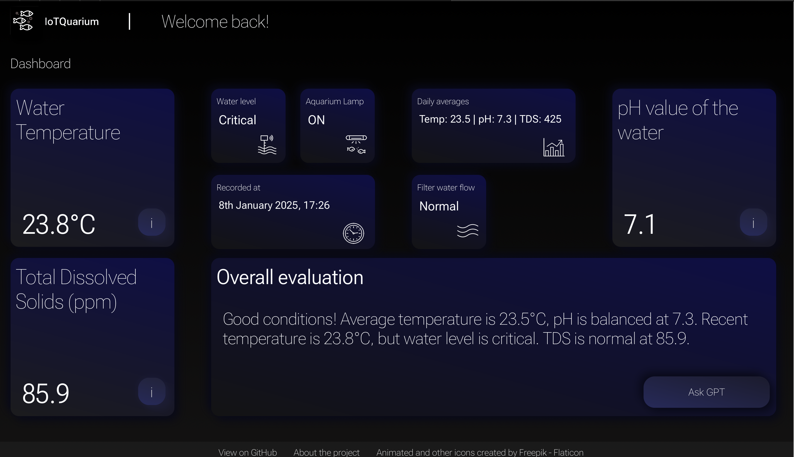
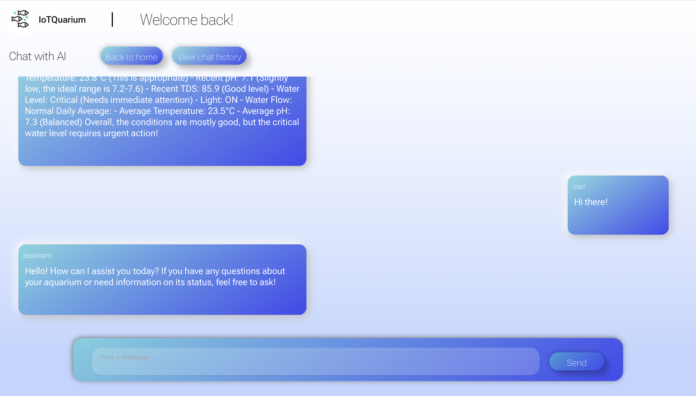

# IoTQuarium_Monitoring
Implementation of my pet project, IoT system which is expected to collect, store and send aquarium environment data to OpenAI API for GPT model analysis, and suggest maintenance actions to the user based on the provided evaluation. The idea is inspired by my passion for aquariums and by me wanting to improve the experience of aquarium keeping.
