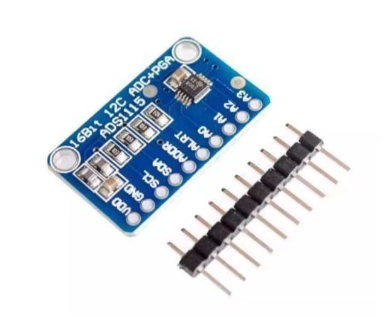

# 🐠 Smart Aquarium Monitoring System 

Implementation of my pet project, IoT system which is expected to collect, store and send aquarium environment data to OpenAI API for GPT model analysis, and suggest maintenance actions to the user based on the provided evaluation. The idea is inspired by my passion for aquariums and by me wanting to improve the experience of aquarium keeping.

---

## Features of the system

- **Real-time continuous data collection**: The system I designed collects real-time data from my aquarium, including water temperature, pH value, Total Dissolved Solids (TDS), lamp status, water level and water flow.

- **Daily averages**: The system calculates and records daily averages of some of the above mentioned values, it's possible to access it through the database or on the dashboard view (only the latest calculation).

- **Tailored overall evaluation**: The dashboard view features overall evaluation widget which is tailored for the latest environment conditions, powered by OpenAI.

- **Ask GPT**: Feature powered by OpenAI, function allowing user to chat with GPT to ask about current conditions in the aquarium or other questions related to aquatic life.

- **Accessible from mobile devices**: The frontend application is optimized for mobile devices.

## Frontend website application
Frontend website serves as an application used to access the smart system, it features dashboard with general recent data view and askGPT function which allows to chat with OpenAI's GPT to ask questions about current aquarium conditions and other aquatic hobby related stuff. 

### Screenshots

#### Dashboard & Chat (Light Mode)

  
  

### Dashboard & Chat (Dark Mode)

  
  

### Technical specifics

- The frontend application is built with Vue.js

- The font used can be found here: https://fonts.google.com/specimen/Roboto+Flex

- The icons and animated logo used can be accessed here: https://www.flaticon.com

### How to run

To launch the frontend app, you need to install Node.js and Vue.js in your terminal (you can run "npm install"). In order to run the app you can use "npm run serve". In order for the app to show anything the server needs to be running too, otherwise the app will show server error widget.

## Backend server application

Backend server application is installed onto raspberry Pi itself as it collects the data by interacting directly with the sensors. The application features automatic sensor data collection, database management and API endpoints for the frontend app. Server application also handles OpenAI requets.

### Technical specifics

- The backend application is built with python and fastAPI

- The app uses OpenAI API requests

- The server app utilizes threads for continuous data collection

### How to run

To launch the backend app, you need to have python 3.10 instaled and python environment (venv) set, and have MongoDB (pymongo) installed and running. Additionally, install dependencies like fastapi 0.86.0, python-dotenv, cors, openai. 

To run the app you need to create OpenAI developer account, get personal API key and integrate it into the app. For that you can create .env file and include OPENAI_API_KEY=<Your_api_key>.

Use this command to run the app:

python -m uvicorn server:app --host 0.0.0.0 --port 3000 --reload

You may need to configure the address of the server application on the frontend, use .yaml configuration file inside the /frontend folder to change and set the correct IP. The IP is <Your machine's IP>:3000

Additionally, you can set different IPs by changing the uvicorn command.

## Hardware Used

The hardware is an important part of the whole system, as it serves as server, collects sensors data, sustains the database and supports the frontend by providing the server services. It may also be used to host the frontend as well.

### Technical specifics 

#### Main board
-  [Raspberry Pi 5 4Gb RAM](https://www.electrokit.com/en/raspberry-pi-5-/4gb?src=raspberrypi)

#### Sensors

- [Temperature sensor (DS18B20)](https://www.aliexpress.com/item/1005006661572551.html?spm=a2g0o.order_list.order_list_main.59.4cfa1802fwZplZ)

- [TDS sensor (TDS Meter V1.0)](https://www.aliexpress.com/item/1005007217904107.html?spm=a2g0o.order_list.order_list_main.29.4cfa1802fwZplZ)

- [Water flow sensor (YF-S201)](https://www.aliexpress.com/item/1005006387653649.html?spm=a2g0o.order_list.order_list_main.47.4cfa1802fwZplZ)

- [Water level sensor (3.3V-5V)]([https://www.aliexpress.com/item/1005006357865283.html?spm=a2g0o.order_list.order_list_main.5.4cfa1802fwZplZ](https://www.aliexpress.com/item/1005006851741952.html?spm=a2g0o.productlist.main.12.20fc606fp0nYrS&aem_p4p_detail=20250311012346363779302387600000028700&algo_pvid=c336bda6-6e32-42e2-8d39-640715e7f235&algo_exp_id=c336bda6-6e32-42e2-8d39-640715e7f235-11&pdp_ext_f=%7B%22order%22%3A%229%22%2C%22eval%22%3A%221%22%7D&pdp_npi=4%40dis%21EUR%212.28%212.28%21%21%2117.52%2117.52%21%40211b655217416814262422596e4c3c%2112000038516652287%21sea%21FI%214368185178%21X&curPageLogUid=tDAXYGhGk83O&utparam-url=scene%3Asearch%7Cquery_from%3A&search_p4p_id=20250311012346363779302387600000028700_4))

- [Light sensor (VEML7700)](https://www.aliexpress.com/item/1005006994624246.html?spm=a2g0o.order_list.order_list_main.11.4cfa1802fwZplZ)

- pH [sensor board](https://www.aliexpress.com/item/1005005732537764.html?spm=a2g0o.order_list.order_list_main.35.4cfa1802fwZplZ) and [probe](https://www.aliexpress.com/item/1005005716591913.html?spm=a2g0o.order_list.order_list_main.17.4cfa1802fwZplZ)

  
  

- [ADS board for analogue connections (ADS1115)](https://www.aliexpress.com/item/32311656694.html?spm=a2g0o.order_list.order_list_main.23.4cfa1802fwZplZ)

  

## Contact

Feel free to contact me if you have any questions. My e-mail is daniil_komov@icloud.com
